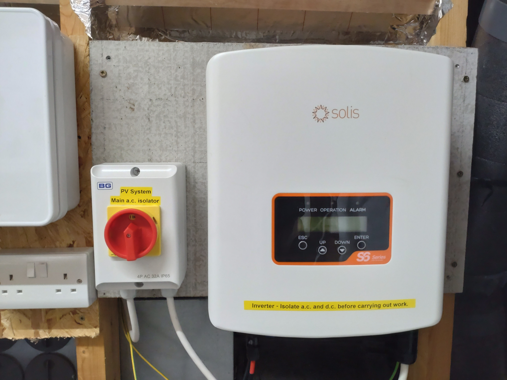
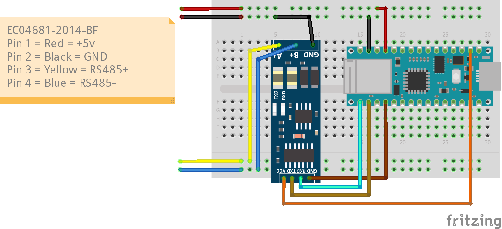
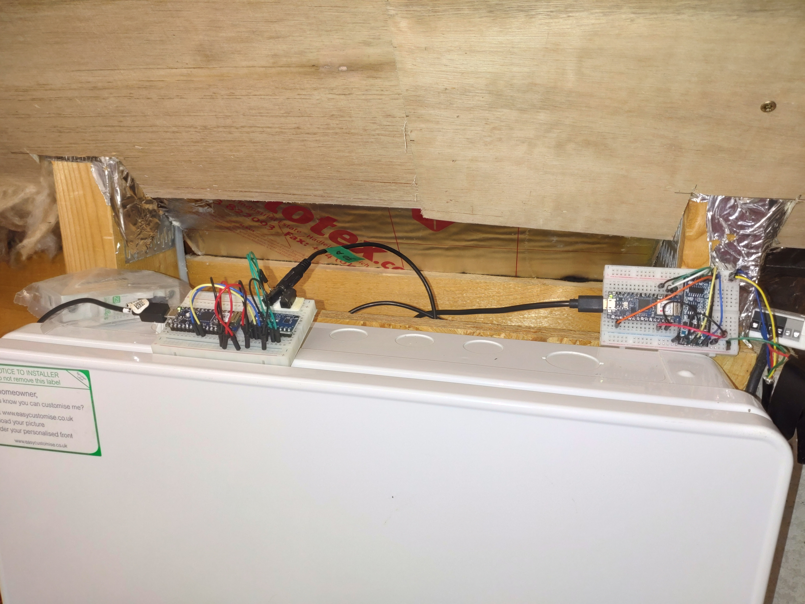

# SolarisS6ArduinoMqtt

## Summary
Project to get data from my Solaris S6 inverter into Home Assistant by MQTT.
This avoids the cost of buying a dongle and any delays/security issues with using the cloud based apps.
Thanks to RichardL64 https://github.com/RichardL64/Solar for seeding the idea.

## Background
I had a project to install Solar PV, a GivEnergy Hybrid Inverter, and GivEnergy batteries scheduled for completion in September 2022.
The panels were installed and the batteries delivered but the hybrid inverter was delayed repeatedly, so I decided to install a "cheap" £300 Solaris S6 inverter with the aim of learning how my panels perform so that I can develope operating strategies before the GivEnergy installation is complete.
This would require collection of data into Home Assistant to compare with consupmtion patterns and solar generation forecasts.
The S6 didn't come with a dongle, so I decided to make my own, this avoids the £75 cost of buying one and any delays/security issues with using the cloud based apps.
Here is the inverter installed in my loft.

## Hardware:
The hardware used for this project
- Arduino Nano33 IOT (plus USB power supply)
- Puretek XY-017 RS485 TO TTL Breakout For Arduino buy here https://www.ebay.co.uk/itm/274273632839
  (note: the silkscreen for the RS485 cables is marked back to front - so if it doesn’t work - swap the cables).
- Exceedconn EC04681-2023-BF Male/Female for Solis/Ginlong Inverter RS-485 port buy here https://www.ebay.co.uk/itm/195464332269
- Breadboard and jumpers
Here is my Fritzing sketch of the set up.

And this is what it looks like installed on the right.

Note the left Nano33 is monitoring a CT on the inverter-distribution board, and the Sonoff Mini-1 to the extreme right runing Tasmota has a temperature sensor wired to GPI04. I had them to hand and used these to keep a check on the inverter while I was developing this project.

## Please note:
1. The code is fairly simple and undocumented. All my bad habits are self-taught!
2. The arduino just posts out the modbus data by mqtt as soon as it reads it, so there isn't any need to hold it locally. It's just keep it in global variables.
3. The functions are crude and do contain some duplications. Configuration for things like modbus and mqtt is hard coded into the functions.
4. As the purpose is to get data into Home Assistant there is quite a lot of mqtt associated with device/entity auto-discovery.
5. The inverter powers down completely when the sun isn't shining (option in the Advanced settings: 24H Switch Disabled) to avoind powering the interter at ~60W overnight. To avoid the risk of corrupted values arriving in HA, the code tests to see if the modbus has stopped communicating to detect inverter powered down.
When that is detected "dynamic" values are set to 0 and "integrated" values are set to their last known value.
6. The password for OTA is hard  coded. All other passwords etc. need setting in arduino-secrets.h 

## Future work:
7. Synchronise the inverter time with the Arduino (and HA). The code reads the time from the Solaris and writes it in json so it can be read.
But I haven't worked out how to get the time data in the Arduino and format it to be written into the modbus.
8. Data resolution. Active Power only reports to the nearest 20W.
This seems weird for an unsigned short (i.e. 0 to 65,535) and an 3.6kW inverter (i.e. 0 to 3,600).  I would have expected to see reporting to the nearest 0.1W.

Any ideas on the above welcomed

Cheers and thank you!

